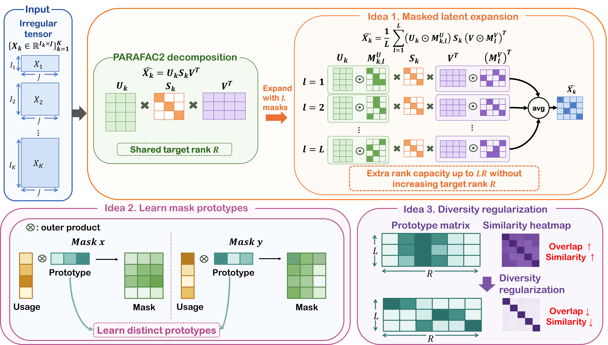

# PRIME

This repository is the official implementation of **"PRIME: Accurate and Compact PARAFAC2 Decomposition for Irregular Tensors via Masked Expansion"** (KDD 2027).
## Overview

<p align="center">
  
</p>


## Requirements

The implementation is based on Python and PyTorch.

Recommended environment:

- Python 3.8+
- PyTorch
- NumPy
- Matplotlib
- Pandas

Install the required packages using:

```bash
pip install -r requirements.txt
```

PyTorch installation may depend on the CUDA version of the system. 

Refer to the official PyTorch installation guide when a specific CUDA build is required.

## Repository Structure

```text
PRIME-main/
├── data/
│   └── tensor/
│       ├── nasdaq_tensor.pkl
│       ├── forbes2000_tensor.pkl
│       ├── pems_tensor.pkl
│       ├── VolumeData_tensor.pkl
│       ├── electricity_tensor.pkl
│       └── metr_tensor.pkl
├── tasks/
│   ├── tensor_reconstruction.py
│   └── tensor_completion.py
├── README.md
├── data.py
├── main.py
├── model.py
├── requirements.txt
├── train.py
└── utils.py
```

The main files are described below.

- `main.py`: Parses experiment arguments and runs the selected task.
- `data.py`: Loads irregular tensors and generates reconstruction or completion splits.
- `model.py`: Implements PRIME and the PARAFAC2-ALS baseline.
- `train.py`: Implements gradient-based and alternating least squares trainers.
- `utils.py`: Provides evaluation metrics, tensor operations, synthetic data generation, and visualization utilities.
- `tasks/tensor_reconstruction.py`: Runs tensor reconstruction experiments.
- `tasks/tensor_completion.py`: Runs tensor completion experiments.


## Datasets

The code supports synthetic and real-world irregular tensors.

Currently supported dataset names include:

- `synthetic`
- `nasdaq`
- `forbes`
- `pems`
- `volume`
- `electricity`
- `metr`

Place real-world tensor files in the following directory:

```text
├── data/
│   ├── tensor/
│   │   └── *.pkl
│   └── split/
│       └── generated split files
```

Each dataset must be stored as either:

- a list of matrices, or
- a dictionary containing the key `"X"`.

Generated completion splits are cached under:

```text
data/split/
```

## Usage

Experiments are executed through `main.py`.

### Tensor Reconstruction

Run PRIME for tensor reconstruction:

```bash
python main.py \
    --task reconstruction \
    --data pems \
    --model pmask \
    --trainer gd \
    --R_list 20,40,60 \
    --mask_ratio 0.15 \
    --gpu 0
```

Run the PARAFAC2-ALS baseline:

```bash
python main.py \
    --task reconstruction \
    --data pems \
    --model parafac2 \
    --trainer als \
    --R_list 20,40,60 \
    --gpu 0
```

Tensor reconstruction uses the observed entries for both training and evaluation. Performance is measured using relative Frobenius error.

### Tensor Completion

Run PRIME for tensor completion:

```bash
python main.py \
    --task completion \
    --data pems \
    --model pmask \
    --trainer gd \
    --R_list 20,40,60 \
    --mask_ratio 0.15 \
    --missing_ratio 0.2 \
    --gpu 0
```

Run the PARAFAC2-ALS baseline:

```bash
python main.py \
    --task completion \
    --data pems \
    --model parafac2 \
    --trainer als \
    --R_list 20,40,60 \
    --missing_ratio 0.2 \
    --gpu 0
```

For tensor completion, the held-out entries are divided equally between validation and test sets. Validation RMSE is used for model selection, and the final performance is measured on the test entries.

## Main Arguments

| Argument | Default | Description |
|---|---:|---|
| `--task` | `reconstruction` | Task type: `reconstruction` or `completion` |
| `--data` | `synthetic` | Dataset name |
| `--model` | `pmask` | Model: `pmask` or `parafac2` |
| `--trainer` | `gd` | Trainer: `gd` or `als` |
| `--R` | `20` | Single target rank |
| `--R_list` | `20` | Comma-separated target ranks |
| `--mask_ratio` | `0.15` | Ratio used to determine the number of mask prototypes |
| `--missing_ratio` | `0.2` | Held-out ratio for tensor completion |
| `--epochs` | `2000` | Maximum number of training iterations |
| `--patience` | `50` | Early-stopping patience |
| `--lr` | `0.1` | Learning rate for gradient descent |
| `--smoothness` | `10` | Smoothness regularization weight |
| `--l2` | `0` | L2 regularization weight |
| `--uniqueness` | `1e-3` | PARAFAC2 alignment regularization weight |
| `--lambda_div` | `1` | Prototype diversity regularization weight |
| `--gpu` | `0` | GPU index |
| `--seed` | `10` | Random seed |
| `--save_dir` | `./checkpoints` | Checkpoint directory |
| `--skip_artifacts` | disabled | Disable checkpoint, curve, plot, and tensor outputs |

The intended model and trainer combinations are:

| Model | Trainer |
|---|---|
| `pmask` | `gd` |
| `parafac2` | `als` |

## Output Files

Depending on the task and options, the code saves the following artifacts:

```text
checkpoints/
├── completion/
├── reconstruction/
├── reconstruction_tensors/
├── svd/
└── plots/

results/
└── reconstruction_<dataset>_<model>_<trainer>_R<rank>_curve.csv
```

The outputs include:

- best model checkpoints
- reconstructed tensor slices
- singular values of reconstructed slices
- training curves
- rank-error diagnostic plots

Use `--skip_artifacts` to disable artifact generation:

```bash
python main.py \
    --task reconstruction \
    --data pems \
    --model pmask \
    --trainer gd \
    --R_list 20 \
    --skip_artifacts
```
